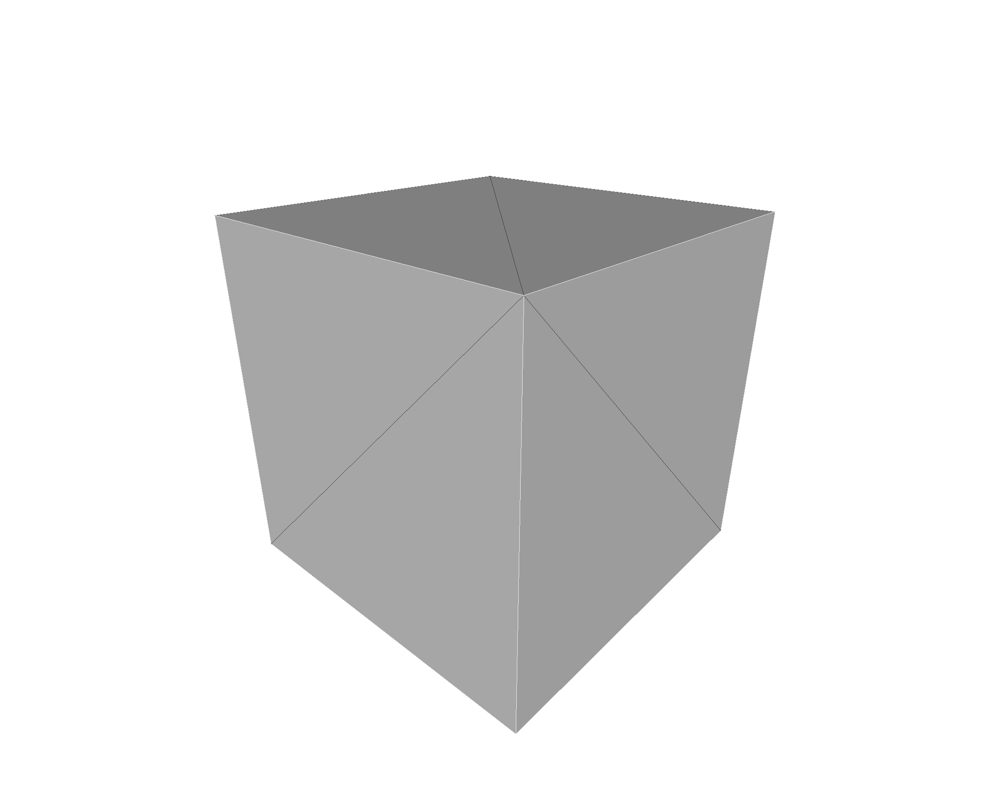
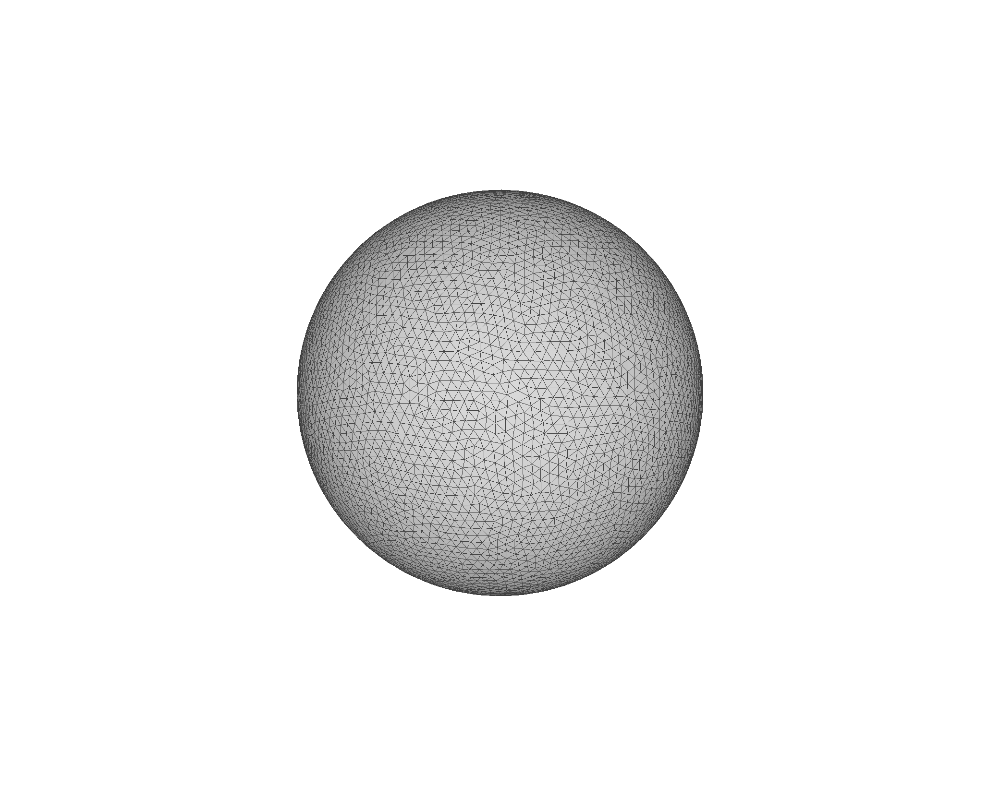

# data
Data sources, such as isosurfaces and meshes, either in repo (small files) or linked to Google drive (large files)

| Name                              | Image                          |   Size | vertices |  faces |
| --------------------------------- | ------------------------------ | -----: | -------: | -----: |
| [`cube.stl`](stl/cube.stl)        |      |   1 kB |        8 |     12 |
| [`sphere.stl`](stl/sphere.stl)    |  |  28 kB |    8,447 | 16,890 |
| [`bunny.stl`](stl/bunny.stl)      |    | 7.5 MB |   14,290 | 28,576 |
| [`bunny_20cm.stl`](stl/bunny.stl) |    | 7.3 MB |   14,290 | 28,576 |

## References:

* Alec Jacobson's commond 3D test models: https://github.com/alecjacobson/common-3d-test-models