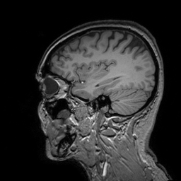
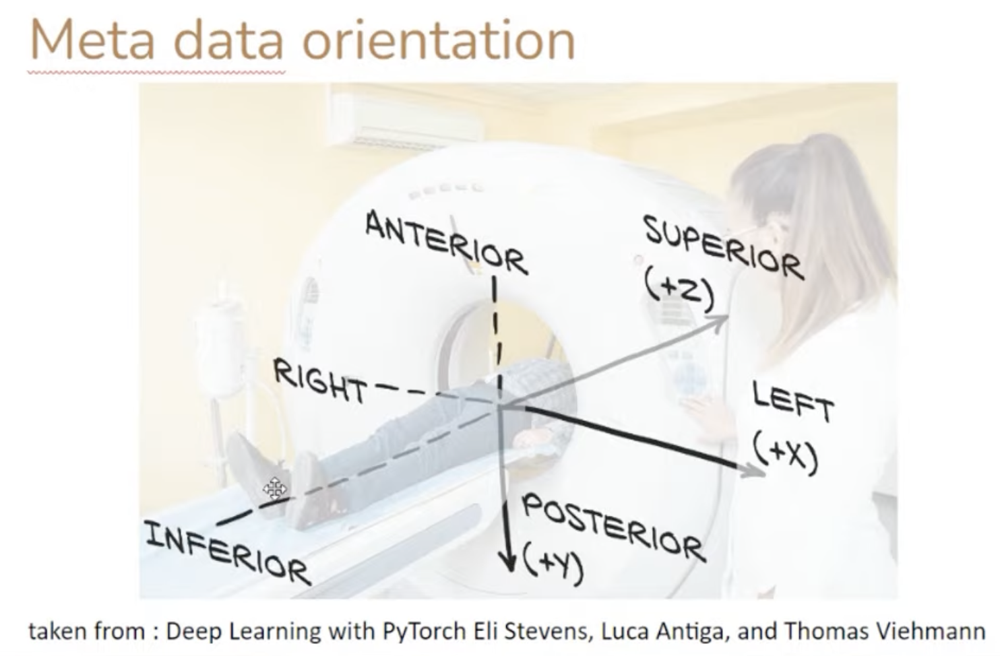

# data

## Example of adding link to Google drive

* Edit the `markdown` file 
* On Google drive, upload file, then create a globally readable link
* Include the link in the markdown
* Push updated markdown file, and any `.png` thumbnail images, to the repo
* Test link from the repo

Link | File Type | Image | File Size
:-: | :-: | :-: | :-: 
[`nefetiti.obj`](https://drive.google.com/file/d/1LIdiA_aTkb5nWL6Zw25SG3x5Kd761LrU/view?usp=sharing) | obj  |  | 3.5MB
[`T1_Utah_SCI.nii`](https://drive.google.com/file/d/12sD8qJqSfPdTjHiUJEZ3pK10-J83v06Q/view?usp=sharing) | NIfTI |  | 109.1MB
[`IXI661-HH-2788-T1.nii`](https://drive.google.com/file/d/1rFx5z95njmdmFpfDcE85NxqQqD4WrAf0/view?usp=sharing) | NIfTI |  | 19.7MB
d2 | e2 | f2 | g2

## Common Data Models

Data sources, such as isosurfaces and meshes, either in repo (small files) or linked to Google drive (large files)

| Name                                                                                             | Image                                                                 |    Size | vertices | faces/volumes |
| ------------------------------------------------------------------------------------------------ | --------------------------------------------------------------------- | ------: | -------: | ------------: |
| [`cube.stl`](stl/cube.stl)                                                                       |                                                 |    1 kB |        8 |            12 |
| [`sphere.stl`](stl/sphere.stl)                                                                   |                                             |   28 kB |    8,447 |        16,890 |
| [`bunny.stl`](stl/bunny.stl)                                                                     |                                               |  7.5 MB |   14,290 |        28,576 |
| [`igea.obj`](https://drive.google.com/file/d/1bUed-C9rrrYngCgQ_I5IVZmmq7lFU0yQ/view?usp=sharing) |                                                 |  9.6 MB |  134,456 |       268,686 |
| [`igea.stl`](https://drive.google.com/file/d/1lSnIZWIib8HR2FcpDnbDm8fHgLy2tfki/view?usp=sharing) |                                                 | 70.7 MB |  134,456 |       268,686 |
| [`igea.inp`](https://drive.google.com/file/d/17LzfODTpLHoGVNML5oKILf-Zpaw9DUcX/view?usp=sharing) |   |   48 MB |  330,175 |       312,752 |


## T1 Utah SCI brain

See [folder](https://drive.google.com/drive/folders/19ul4aOjraVyYSeJfPZzSj-rAif6S4621?usp=sharing) containing `T1_Utah_SCI_brain` in format `npy, stl` and `T1_Utah_SCI_outer` in `npy, stl`, `T1_Utah_SCI.nii`, and `T1_Utah_SCI.yaml`.

## RMU source files


* [`All_Hex_Dec.inp`](https://drive.google.com/file/d/1CpiqOSwjqh3XdQfoi3VjlyCyVvH6tplR/view?usp=share_link) 212 MB
* `Subject D`
  * 18 year old female
  * 10 `.stl` files total:

| Name                                       | Image                                                          |   Size | vertices | faces/volumes |
| ------------------------------------------ | -------------------------------------------------------------- | -----: | -------: | ------------: |
| brainstem [`Aseg_dura_falx_tent_BS.stl`]() |  | 862 kB |    8,626 |        17,248 |
| midbrain [`Aseg_dura_falx_tent_MB.stl`]()  |  | 3.6 MB |   35,522 |        71,092 |
| ventricles [`Aseg_dura_falx_tent_V.stl`]() |    | 1.7 MB |   17,174 |        34,328 |

2022-08-16:  More to come.

```bash
Cubit>graphics perspective off  # orthogonal, not perspective view
Cubit>view iso # isometric x, y, z camera
Cubit>up 0 0 1  # z-axis points up
```

## Simić brainstem

From [GrabCAD](https://grabcad.com/library/brain-healthy-1)

Brain (healthy), Slobodan Simić, April 2nd, 2019

Healthy human brain. Model shows complete brain with separated models for cerebellum, cerebrum, brain stem and corpus callosum. The model was segmented from MRI file downloaded at http://www.sci.utah.edu/sci-headmodel.html , model T1.
"This project was supported by the National Institute of General Medical Sciences of the National Institutes of Health under grant number P41 GM103545-18."

Six files:

* [complete_brain.stl](https://drive.google.com/file/d/1AjGQPhIUnCSA3qUfbEX5bKlxTIcwk32C/view?usp=sharing)
* [brainstem+corpus_callosum.stl](https://drive.google.com/file/d/1C8YXm27nnC-B7eIRLxjbJTnLro8j8jD3/view?usp=sharing)
* [corpus_callosum.stl](https://drive.google.com/file/d/1HTf4cWDtylbSYc-2ckhLMjryzPjWg-Uq/view?usp=sharing)
* [brainstem.stl](https://drive.google.com/file/d/1UneGYeMKp7ga8xIo-x9DJpRnMijTmVdR/view?usp=sharing)
* [cerebrum.stl](https://drive.google.com/file/d/1dSngyuuJVlngjDIE84ko1YNuy4ihooyq/view?usp=sharing)
* [cerebellum.stl](https://drive.google.com/file/d/1XSKgvZIDCAK8thxGpVGtZLpiraT5ttSn/view?usp=sharing)

## See Also

* Spherical meshes used in https://github.com/autotwin/mesh/blob/main/doc/spherical_baseline.md

## References:

* SCI Head model: https://www.sci.utah.edu/sci-headmodel.html
* IXI Dataset: https://brain-development.org/ixi-dataset/ 
* Alec Jacobson's commond 3D test models: https://github.com/alecjacobson/common-3d-test-models


