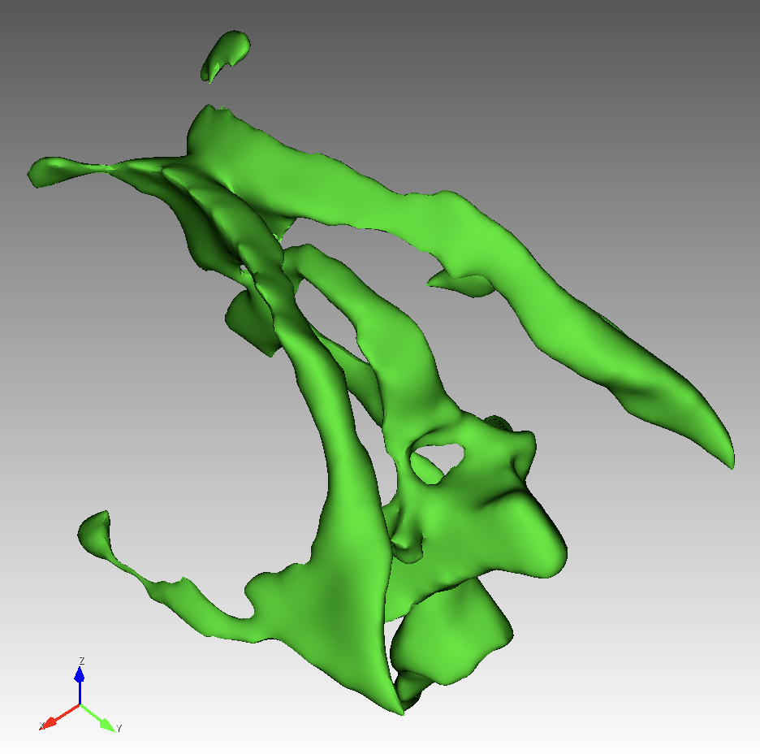

# data

## Example of adding link to Google drive

* Edit the `markdown` file 
* On Google drive, upload file, then create a globallly readable link
* Include the link in the markdown
* Push updated markdown file, and any `.png` thumbnail images, to the repo
* Test link from the repo

Col1 | Col2 | File Size
--- | --- | --- 
[`nefetiti.obj`](https://drive.google.com/file/d/1LIdiA_aTkb5nWL6Zw25SG3x5Kd761LrU/view?usp=sharing) |  | 3.5MB
[`T1_Utah_SCI`](https://drive.google.com/drive/folders/14XLkYlxQYVhJTOFZutao2VtpFadhOhTc?usp=sharing) |  | 95.1MB
d2 | e2 | f2

## Common Data Models

Data sources, such as isosurfaces and meshes, either in repo (small files) or linked to Google drive (large files)

| Name                                                                                             | Image                                                                 |    Size | vertices | faces/volumes |
| ------------------------------------------------------------------------------------------------ | --------------------------------------------------------------------- | ------: | -------: | ------------: |
| [`cube.stl`](stl/cube.stl)                                                                       |                                                 |    1 kB |        8 |            12 |
| [`sphere.stl`](stl/sphere.stl)                                                                   |                                             |   28 kB |    8,447 |        16,890 |
| [`bunny.stl`](stl/bunny.stl)                                                                     |                                               |  7.5 MB |   14,290 |        28,576 |
| [`igea.obj`](https://drive.google.com/file/d/1bUed-C9rrrYngCgQ_I5IVZmmq7lFU0yQ/view?usp=sharing) |                                                 |  9.6 MB |  134,456 |       268,686 |
| [`igea.stl`](https://drive.google.com/file/d/1lSnIZWIib8HR2FcpDnbDm8fHgLy2tfki/view?usp=sharing) |                                                 | 70.7 MB |  134,456 |       268,686 |
| [`igea.inp`](https://drive.google.com/file/d/17LzfODTpLHoGVNML5oKILf-Zpaw9DUcX/view?usp=sharing) |   |   48 MB |  330,175 |       312,752 |

## RMU source files

* `Subject D`
  * 18 year old female
  * 10 `.stl` files total:

| Name                                       | Image                                                          |   Size | vertices | faces/volumes |
| ------------------------------------------ | -------------------------------------------------------------- | -----: | -------: | ------------: |
| brainstem [`Aseg_dura_falx_tent_BS.stl`]() |  | 862 kB |    8,626 |        17,248 |
| midbrain [`Aseg_dura_falx_tent_MB.stl`]()  |  | 3.6 MB |   35,522 |        71,092 |
| ventricles [`Aseg_dura_falx_tent_V.stl`]() |    | 1.7 MB |   17,174 |        34,328 |

2022-08-16:  More to come.

```bash
Cubit>graphics perspective off  # orthogonal, not perspective view
Cubit>view iso # isometric x, y, z camera
Cubit>up 0 0 1  # z-axis points up
```

## See Also

* Spherical meshes used in https://github.com/autotwin/mesh/blob/main/doc/spherical_baseline.md

## References:

* Alec Jacobson's commond 3D test models: https://github.com/alecjacobson/common-3d-test-models
