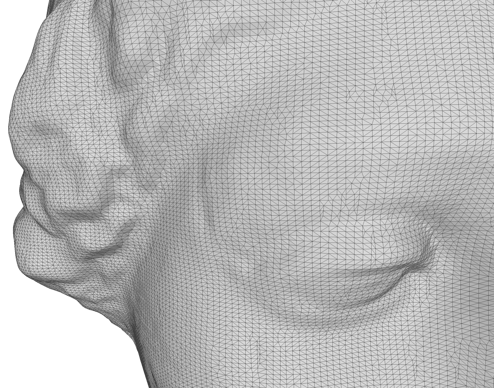

# data
Data sources, such as isosurfaces and meshes, either in repo (small files) or linked to Google drive (large files)

| Name                                                                                             | Image                                                   |    Size | vertices |   faces |
| ------------------------------------------------------------------------------------------------ | ------------------------------------------------------- | ------: | -------: | ------: |
| [`cube.stl`](stl/cube.stl)                                                                       |                                   |    1 kB |        8 |      12 |
| [`sphere.stl`](stl/sphere.stl)                                                                   |                               |   28 kB |    8,447 |  16,890 |
| [`bunny.stl`](stl/bunny.stl)                                                                     |                                 |  7.5 MB |   14,290 |  28,576 |
| [`bunny_20cm.stl`](bunny.stl)                                                                    |                                 |  7.3 MB |   14,290 |  28,576 |
| [`igea.obj`](https://drive.google.com/file/d/1bUed-C9rrrYngCgQ_I5IVZmmq7lFU0yQ/view?usp=sharing) |   |  9.6 MB |  134,456 | 268,686 |
| [`igea.stl`](https://drive.google.com/file/d/1lSnIZWIib8HR2FcpDnbDm8fHgLy2tfki/view?usp=sharing) |   | 70.7 MB |  134,456 | 268,686 |

## References:

* Alec Jacobson's commond 3D test models: https://github.com/alecjacobson/common-3d-test-models